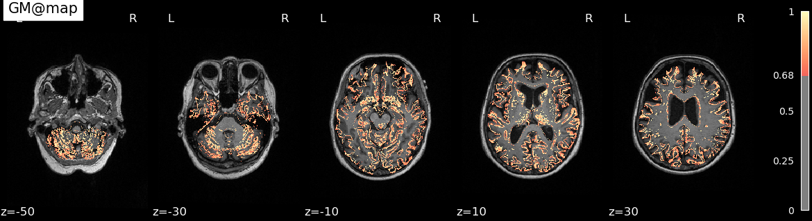
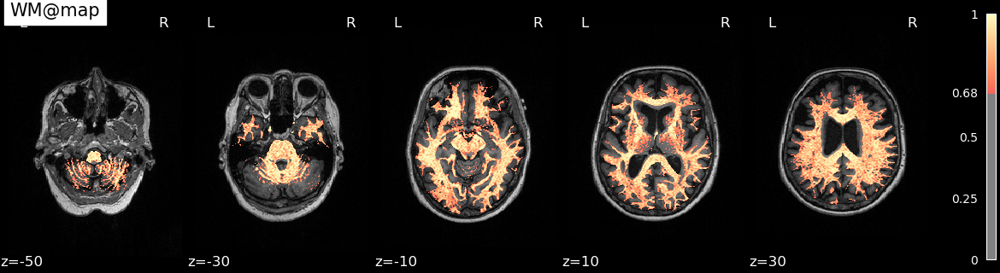
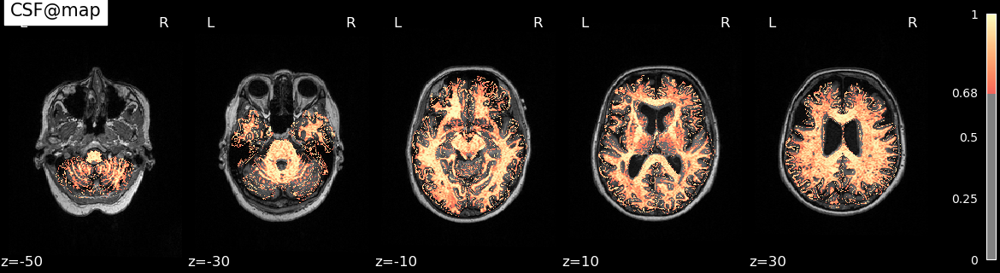
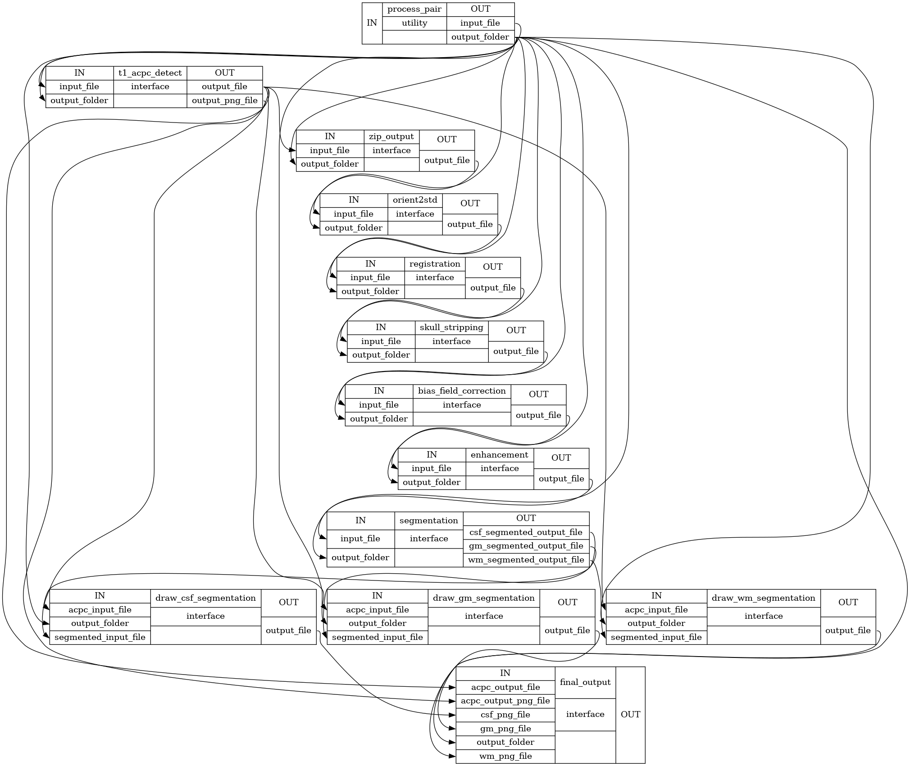

<div align="center" style="text-align: center">

# **Nipype: Preprocessing Pipeline on Brain MR Images**

<p style="text-align: center">
  
  
  
</p>
</div>

> Tested on x86/64 Linux-based system.

The project is used to do preprocessing on brain MR images (`.nii` files).

There is a pipeline include those features:

- Dockerize the environment
- Auto AC-PC detection & alignment
- Registration
- Skull Stripping
- Segmentation (using `K-means` to split GM, WM and CSF)
- Visualize the results (using `nilearn`)

All the features implemented as `nipype`'s interface are connected in a workflow.

## Prerequisites

In this repo, the dataset is downloaded from [LONI Image Data Archive (IDA)](https://ida.loni.usc.edu/login.jsp).
Collect and download AD and NC screening sample of ADNI1 and ADNI2, and extract them into this folder.  

You can just place the `.nii` samples in `./data`.

> If you only have DICOM files, you can use [DICOM to NIfTI Online Converter](https://www.onlineconverter.com/dicom-to-nifti) to convert them into NIfTI format.

For example, folder `./data` structure is like this:

```
./data
├── 099_S_4206.nii
└── 099_S_4205.nii

0 directories, 2 files
```

## Usage

1. Build Neuro Docker image

```bash
docker build --tag neuro:latest --file Dockerfile.neuro .
```

2. Build custom Docker image

> We need to install custom tools in the Docker image.

```bash
docker build --tag neuro_custom:latest --file Dockerfile .
```

3. Run the workflow

```bash
docker run --rm -it \
    --workdir /src \
    --volume ./src:/src \
    --volume ./utils:/utils \
    --volume ./data:/data \
    --volume ./output:/output \
    --name neuro_workflow \
    neuro_custom python workflow.py
```

### Results

Segmentation results are shown as cover.

When the workflow ran successfully, all the results of each step will be saved in `./output`.

And the workflow graph will be saved in `./src/graph_detailed.png`.



## Utilities

The useful `Automatic Registration Toolbox` we used are listed below:

- acpcdetect v2.1 Linux
- ATRA v1.0 Linux

They are downloaded from [NITRC](https://www.nitrc.org/projects/art) and put in `./utils`.

## Reference

- [quqixun/BrainPrep](https://github.com/quqixun/BrainPrep)
- [nipype](https://nipype.readthedocs.io/en/latest/)
- [nilearn](https://nilearn.github.io/)
- [neurodocker](https://github.com/ReproNim/neurodocker)

## Misc

### Generate Neuro Dockerfile and Build Docker Image

1. Install `neurodocker`
    ```bash
    pip install neurodocker
    ```

2. Generate Dockerfile using `neurodocker`
    ```bash
    neurodocker generate docker \
        --pkg-manager apt \
        --base-image neurodebian:bullseye \
        --fsl version=6.0.5.1 \
        --ants version=2.4.1 \
        --miniconda version=latest conda_install="nipype" \
    > Dockerfile.neuro
    ```

3. Build the docker image with the generated Dockerfile
    ```bash
    docker build --tag neuro:latest --file Dockerfile.neuro .
    ```

## Contributor

<!-- ALL-CONTRIBUTORS-LIST:START - Do not remove or modify this section -->
<!-- prettier-ignore-start -->
<!-- markdownlint-disable -->
<table>
  <tbody>
    <tr>
      <td align="center"><a href="https://github.com/NatLee"><br /><sub><b>Nat Lee</b></sub></a></td>
    </tr>
  </tbody>
</table>

<!-- markdownlint-restore -->
<!-- prettier-ignore-end -->

<!-- ALL-CONTRIBUTORS-LIST:END -->
