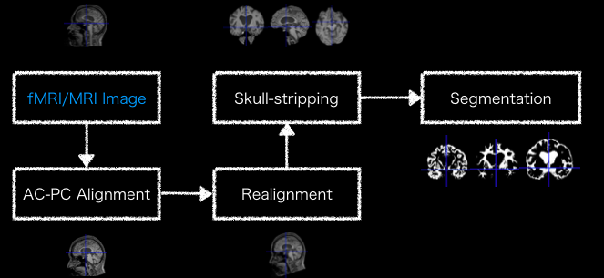

# Preprocessing Pipeline on Brain MR Images

Modify from a repository [quqixun/BrainPrep](https://github.com/quqixun/BrainPrep).

The project is used to do preprocessing on brain MR images.

There is a pipeline include those features:

- Auto AC-PC Detection
- Registration
- Skull Stripping
- Segmentation

## Requirements

All required libraries are listed as below:

- tqdm
- numpy
- scipy
- nipype
- nibabel
- matplotlib
- scikit-learn

```bash
pip3 install -r requirement.txt
```

## Usage

### Download and Install Tools

- Download and install **FSL** as instructions [here](https://fsl.fmrib.ox.ac.uk/fsl/fslwiki/Fsl**ANTs**) from source code in [Linux and macOS](https://github.com/ANTsX/ANTs/wikiInstallation).  
- Compile /Compiling-ANTs-on-Linux-and-Mac-OS), or in [Windows 10](https://github.com/ANTsX/ANTs/wiki/Compiling-ANTs-on-Windows-10).
- Download Auto AC-PC tools [here](https://www.nitrc.org/projects/art) into `./utils` if you're not using MacOS.
- Download ATRA tools in the same link [here](https://www.nitrc.org/projects/art) into `./utils` if you're not using Linux-based system.

### Download Dataset

See [README.md in *data*](./data/README.md).

The data can put in `./data`, for example `./data/ADNI/T1.nii`

### Run the pipeline

```bash
python3 main.py
```

### Results



## Future

- Multiprocessing
- Clean code
- ...
